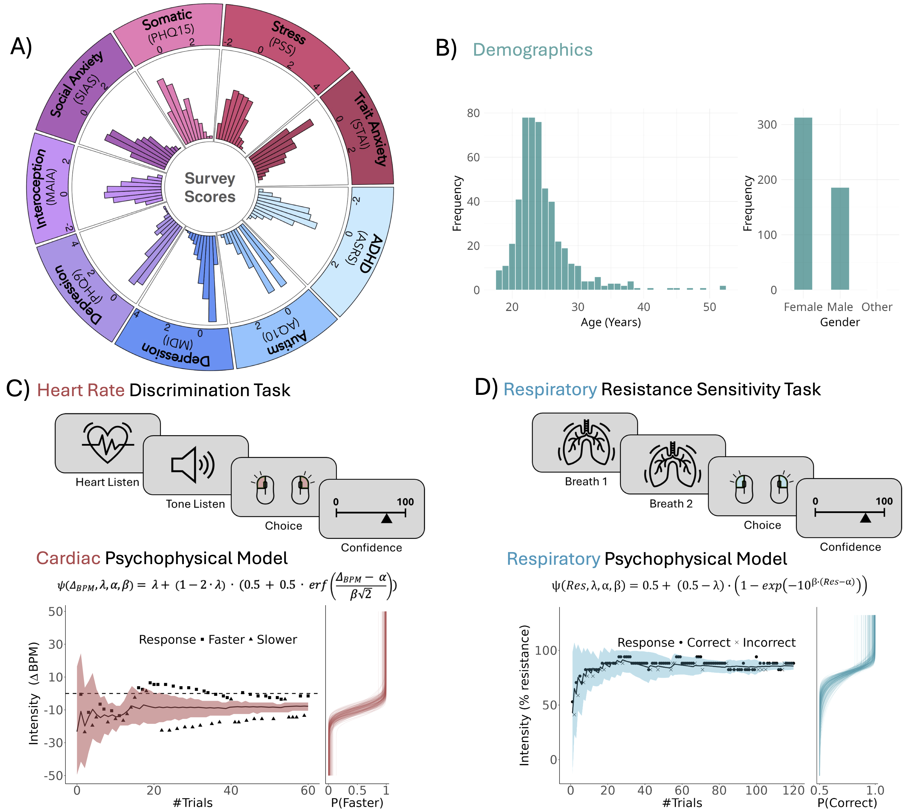
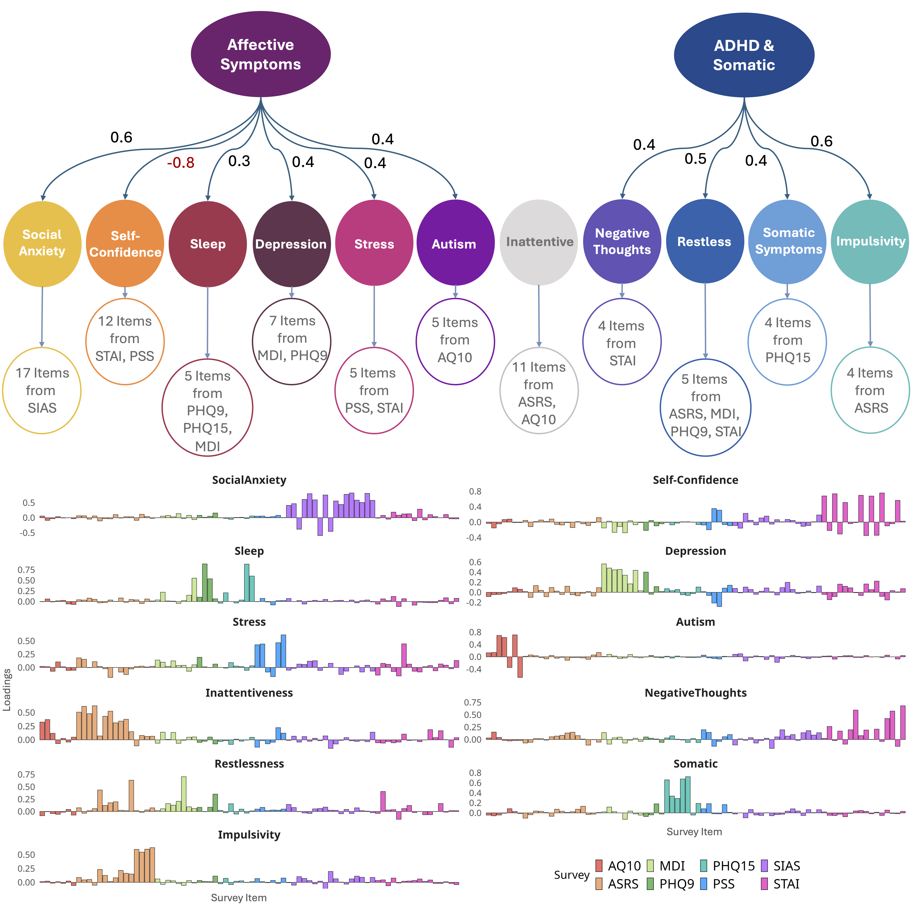
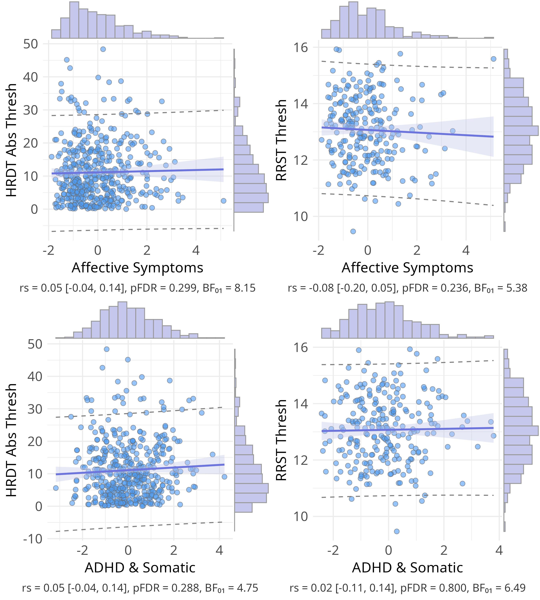
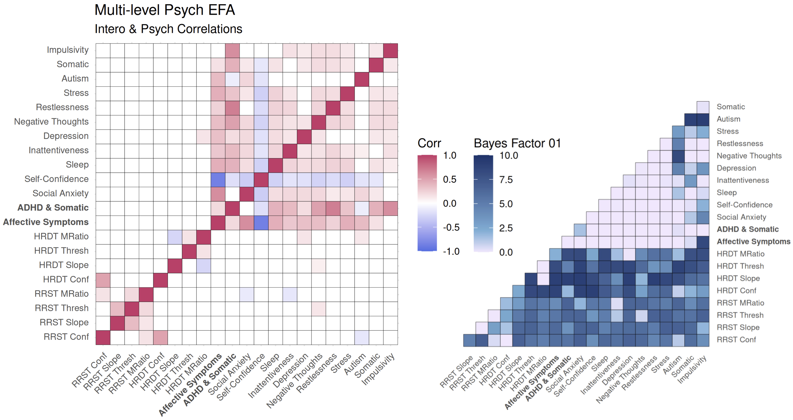
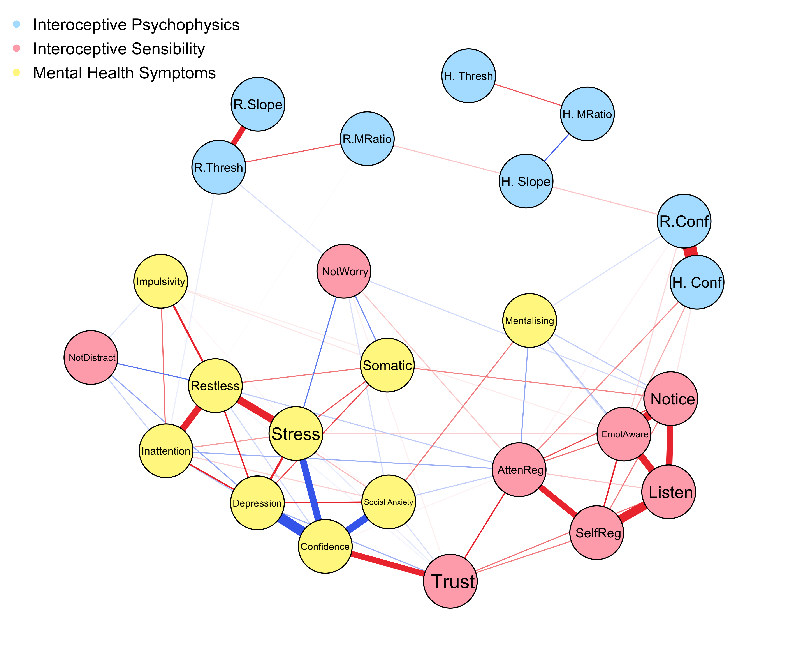

  # Interoceptive Performance is Unrelated to Mental Health Symptoms: Evidence From a Large Scale Multi-Domain Psychophysical Investigation
  

Leah Banellis, Niia Nikolova, Jesper Fischer Ehmsen, Arthur S. Courtin, Melina Vejlø, Ashley Tyrer,  Rebecca A. Böhme, Francesco Bavato, Kelly Hoogervorst, Francesca Fardo, Micah G. Allen

---

## Abstract

Interoception—the sensing and perception of the internal viscera—is widely cast as a transdiagnostic mechanism linking brain–body interaction to mental illness. Prevailing models propose that altered interoceptive performance is associated with psychiatric vulnerability across a range of symptoms. We tested this hypothesis in a large community sample (N = 547) using psychophysically optimised tasks spanning cardiac and respiratory domains, combined with hierarchical Bayesian modelling and comprehensive symptom profiling. Contrary to this central prediction, objective interoceptive performance spanning sensitivity, precision, and metacognition were largely unrelated to general symptom burden or specific mental health dimensions across linear, categorical, and network-based models. In contrast, self-reported interoceptive sensibility showed moderate associations with symptoms, but semantic similarity analyses suggest these reflect higher order interpretative or affective beliefs rather than specific interoceptive processing. These findings challenge the prevailing view that objective interoceptive sensitivity is a broad marker of psychopathology, prompting a reconsideration of how we measure and interpret interoception in mental health research.

---

## Preprint

Access the preprint here: [https://www.medrxiv.org/content/10.1101/2025.08.25.25334366v1)

---

## Citation

> Banellis, L., Nikolova, N., Ehmsen, J. E., Courtin, A. S., Vejlø, M., Tyrer, A., Böhme, R., Bavato, F., Hoogervorst, K., Fardo, F., Allen, M. G. (2025). Interoceptive Performance is Unrelated to Mental Health Symptoms: Evidence From a Large Scale Multi-Domain Psychophysical Investigation. Medrxiv. 

### Figure 1:
|   |
|:--:| 
| Figure 1: Mental health assessment and multimodal interoception test battery. |
>A) Normalised distributions of mental health survey scores across eight instruments (autism spectrum (AQ10), ADHD (ASRS), depression (MDI and PHQ9), somatic symptoms (PHQ15), stress (PSS), social anxiety (SIAS), trait anxiety (STAI trait)), and interoceptive sensibility (MAIA). B) Age and gender demographics distributions of the N = 500 sample for the mental health factor analysis. Participants performed two interoceptive psychophysical tasks of two sensory modalities: C) the Heart Rate Discrimination Task (HRDT), D) the Respiratory Resistance Sensitivity Task (RRST). Each task employed an adaptive psychophysical model estimating threshold (α), precision (β), and lapse rate (λ). In the HRDT, participants compared the rate of auditory tones to their real-time heart rate (via pulse oximeter) and rated confidence. In the RRST, participants inhaled twice through a respiratory circuit, judged which breath felt more difficult, and reported their confidence via visual analogue scale. In all conditions, the stimulus intensity was adaptively adjusted using the Psi algorithm; see Methods for more details. Example plots (bottom) display the stimulus adjustments (respiratory resistance, tone frequency) across trials for a single participant, alongside the psychometric fits that quantify interoceptive (cardiac or respiratory) performance.

### Figure 2:
|   |
|:--:| 
| Figure 2: Multi-level factor solution of mental health dimensions. |
>Exploratory Factor Analysis (EFA) of items from eight mental health surveys. The top figure shows the EFA path diagram, revealing 11 lower-level factors: social anxiety, self-confidence, sleep, inattentiveness, depression, negative thoughts, restlessness, stress, autism spectrum, somatic symptoms, and impulsivity, as well as two higher-level factors: affective symptoms, and ADHD & somatic symptoms. The bottom shows the lower-level factor loadings (pattern coefficients) on the inputted survey items (autism spectrum (AQ10), ADHD (ASRS), depression (MDI and PHQ9), somatic symptoms (PHQ15), stress (PSS), social anxiety (SIAS), and trait anxiety (STAI trait)). For the first-level factor analysis: see Supplementary Table 3 for full item pattern coefficients, and Supplementary Table 4 for a full list of items in each factor. For the higher-level factor analysis: see Supplementary Table 5 for pattern coefficients, and Supplementary Table 4 for details of lower-level factors in each high-level factor.

### Figure 3:
|   |
|:--:| 
| Figure 3: Scatter plots of the null relationship between interoceptive performance (threshold) and mental health higher-level factors. |
>Scatter plots of Spearman correlations across interoception task variables and mental health higher-level factors. Interoceptive performance is demonstrated via sensitivity for the cardiac (HRDT absolute threshold) and respiratory (RRST threshold) psychophysical tasks. For mental health correlations with interoceptive precision (slope) see Supplementary Figure 1. Above shows statistics for Spearman correlations with 95% confidence intervals in square brackets, p-values are corrected for multiple comparisons using the false discovery rate (Benjamini-Hochberg procedure at < 0.05), and null bayes factors (BF01). 

### Figure 4:
|   |
|:--:| 
| Figure 4: Correlations between interoceptive psychophysics and mental health factors. |
>Left: Cross Spearman correlations across interoception task variables and mental health factors (11 lower-level and two higher-level EFA). Interoceptive task variables include sensitivity (threshold (absolute for HRDT)), precision (slope), metacognitive bias (mean confidence), and metacognitive efficiency (M-Ratio) across cardiac (HRDT) and respiratory (RRST) domains. The upper diagonal depicts correlations that survive false discovery rate correction for multiple comparisons (Benjamini-Hochberg procedure at < 0.05 shown in upper diagonal coloured boxes), whereas the lower diagonal depicts correlation coefficients significant at the uncorrected threshold (uncorrected p < .05; lower diagonal coloured boxes). In red are significant positive correlations and in blue are significant negative correlations (p < 0.05 shown in coloured boxes). Right: Heatmap depicting null bayes factors (BF01) for interoceptive performance and mental health factors. The majority of observed Null Bayes Factors show anecdotal (BF01 1 - 3 in light blue) or moderate (BF01 3 - 10 in dark blue) evidence for a lack of association62, with slightly stronger null evidence for cardiac variables compared to respiratory variables63. However, some exceptions include anecdotal Bayesian evidence for the alternative hypothesis (BF01 0.33 - 1 in light purple) with inattentiveness, autism, and negative thoughts factors with interoception metrics (as well as BF01=0.07 for the depressive symptoms with cardiac metacognition relationship described above). 

### Figure 8:
|   |
|:--:| 
| Figure 8. Joint network analysis of mental health and interoception. |
>EBICglasso-estimated network embedding mental health communities (yellow nodes from psychiatric network analysis of survey items in Figure 7), interoceptive psychophysics (cardiac HRDT (‘H.’ variables in blue) and respiratory RRST (‘R.’ nodes in blue) sensitivity (‘Thresh’), precision (‘Slope’), confidence (‘Conf’), and metacognitive efficiency (‘MRatio’), and interoceptive sensibility (MAIA subscales nodes in red). Edges represent regularised partial correlations after controlling for all other items, with red and blue edges indicating positive and negative associations, respectively (edge thickness reflects strength). Mental health–interoceptive psychophysics connections were sparse and weak, whereas several MAIA subscales showed moderate cross-domain associations, indicating stronger coupling of subjective interoceptive sensibility than objective interoceptive performance with psychiatric symptom domains.

# Scripts for Analyses

    **1. Mental Health Factor Modelling**:  
        /InteroMentalHealth/scripts/PsychEFA_selected.Rmd
        (Note, raw mental health scores are hidden due to Danish privacy law)
          
    
    **2. Correlation Analyses & Null Bayes Factors**:  
        /InteroMentalHealth/scripts/InteroMentalHealth.Rmd

    **3. Clinical Cut-Off Analyses**:  
        /InteroMentalHealth/scripts/psych_inputplots_andcutoffs.Rmd

    **4. Network Analyses**:  
        /InteroMentalHealth/scripts/InteroMentalHealth_network.Rmd
    
    
    **3. MAIA Semantic Similarity Analysis Wordcloud**:  
        /InteroMentalHealth/scripts/semanticsimilarity_wordcloud.py
        /InteroMentalHealth/scripts/semanticsimilarity_wordcloud_MAIAsubscales.ipynb
  
